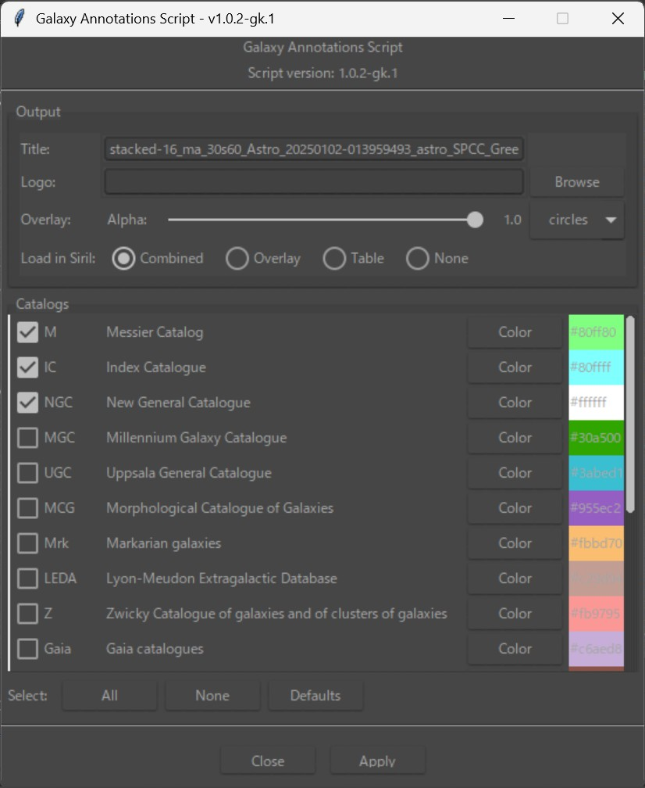
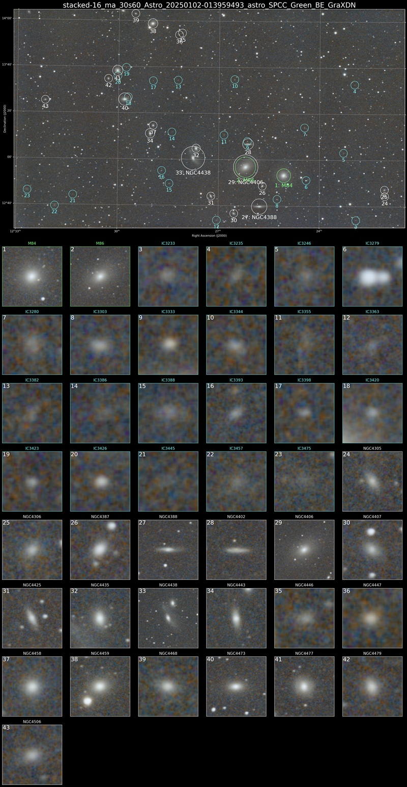
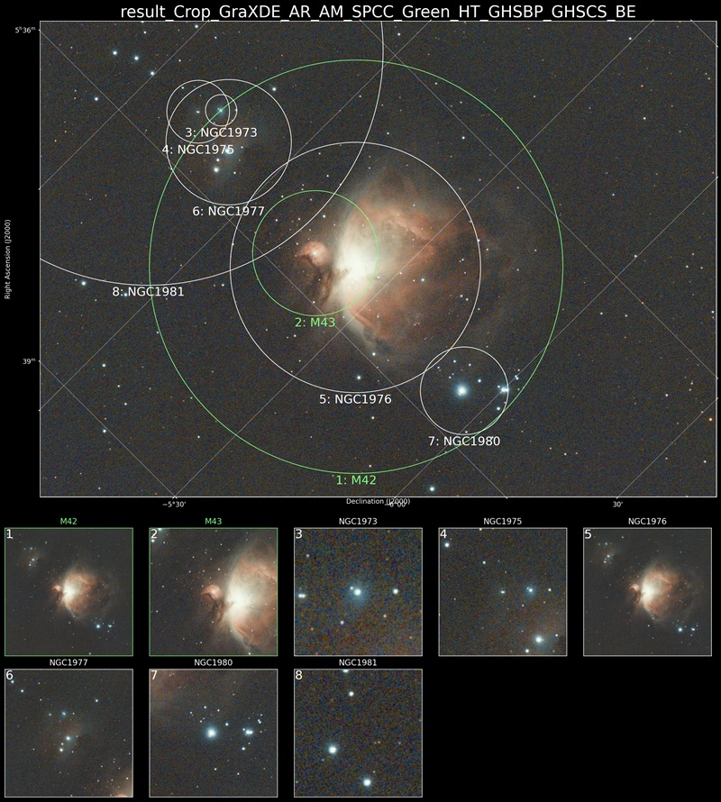

# Siril用 銀河アノテーションスクリプト（バージョン 1.0.2-gk.1、作成者 gonkane）

このスクリプトは、Siril における天体画像に銀河をアノテーション表示する Python スクリプトのカスタム版です。  
元のスクリプトは Steffen Schreiber 氏と Patrick Wagner 氏によって作成されたものをベースにしています。

この改良版（バージョン 1.0.2-gk.1）では、以下の点に改良を加えています：

---

## 追加機能一覧

- Messier、NGC、IC の一部が表示されなかった問題に対応するため、Siril に組み込まれたカタログデータを使用
- カタログごとに色を個別に設定可能
- カタログ一覧を縦スクロール可能な形式に変更

---

## 対応環境

- Siril バージョン 1.4.0-beta2 以上
- Pythonモジュール（Sirilが自動でインストールまたは要求する）：
  - sirilpy（バージョン 0.6.37 以上）
  - numpy, pandas, matplotlib, Pillow
  - astropy, astroquery, scikit-image, ttkthemes

---

## スクリーンショット

### GUI画面

### 出力例 1

### 出力例 2

---

## Siril での使い方（準備から実行まで）

### 1. Siril のバージョン確認

このスクリプトは Siril v1.4.0-beta2 以降で動作します。  
Siril のメニュー「ヘルプ → バージョン情報」で確認してください。

---

### 2. スクリプトを保存する

`Galaxy_Annotations_102gk1.py` を、任意の使いやすいフォルダに保存します。  
例： `C:\Users\<あなたの名前>\Documents\SirilScripts\`

---

### 3. Siril にスクリプトの保存先を設定する

1. Siril を起動  
2. メニューから「≡ → 環境 設定」を開く  
3. 「スクリプト」タブを開く  
4. 「スクリプト保存ディレクトリ」の欄に、上で保存したフォルダのパスを入力する  
5. 「適用」を押して環境設定を閉じる  

もしこの設定の仕方がよく分からない場合は、通常であれば  
`C:\Users\（ユーザー名）\AppData\Local\siril-scripts\utility`  
の中に元の `Galaxy_Annotations.py` があるので、そこに `Galaxy_Annotations_102gk1.py` を置いておくだけでも問題ありません。

---

### 4. 星の位置情報が付与された画像を開く

このスクリプトは赤経・赤緯（RA/DEC）情報をもとに銀河の位置を特定するため、  
必ずSirilのアストロメトリーなどで星の位置情報が付与された画像を使用してください。

---

### 5. スクリプトを実行する

1. Siril のメニューから「スクリプト → Python Scripts」を選択  
2. `Galaxy_Annotations_102gk1.py` を選んで実行  

---

### 6. 設定してアノテーションを生成

設定ウィンドウが表示されます：

- Title：作成画像に表示される名前
　日本語が入っているとその部分は四角になります。
- Logo：指定したJPEGやPNG画像を天体一覧の右下に追加する
- 表示したいカタログ：チェックを入れて選択、色もカスタマイズ可能

すべて設定したら「Apply」ボタンをクリックしてください。

---

### 7. 出力ファイルについて

画像処理が完了すると、次の3種類の画像が出力されます（元画像と同じフォルダに保存されます）：

| ファイル名例                  | 内容                             |
|------------------------------|----------------------------------|
| `annotated_M101_overlay.png` | 銀河アノテーション付きの画像     |
| `annotated_M101_table.png`   | 検出された銀河のサムネイル表     |
| `annotated_M101.png`         | 上記2枚を縦に結合した最終画像     |

Siril の画面でどれを読み込むかを選ぶオプションも用意されています。

---

## 注意点

Messier、NGC、IC のデータについては、Siril に内蔵されている以下の `.csv` ファイルを使用します：

C:/Program Files/Siril/share/siril/catalogue

yaml
コピーする
編集する

この中に次のファイルが存在する必要があります：

- `messier.csv`
- `ngc.csv`
- `ic.csv`

スクリプト実行時にこれらのファイルが見つからずエラーが発生する場合は、  
お使いのPC内で `messier.csv` を検索し、スクリプト内の該当パス（約162行目）を実際の場所に合わせて修正してください。

---

## 著作権とライセンス

このスクリプトは、以下のプロジェクトをベースにした改良版です：

- オリジナル作者: Steffen Schreiber 氏、Patrick Wagner 氏  
- 元スクリプト：<https://gitlab.com/schreiberste/siril-scripts>

ライセンスは GNU General Public License v3 またはそれ以降です。  
詳しくはリポジトリ内の `LICENSE` ファイルをご参照ください。
