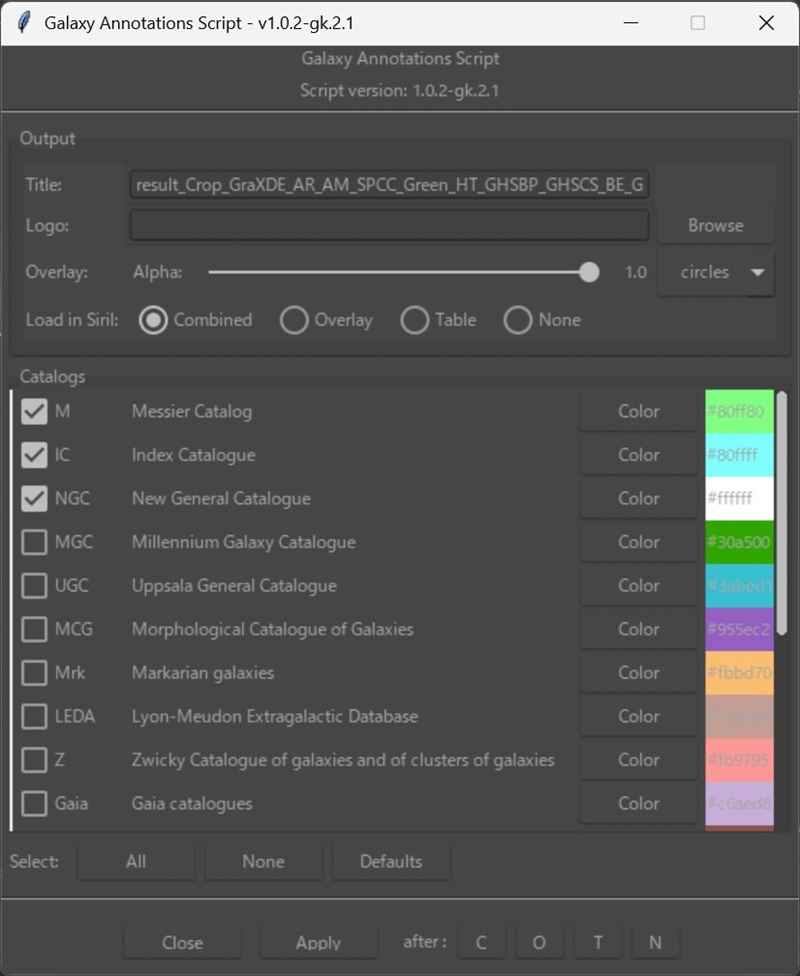
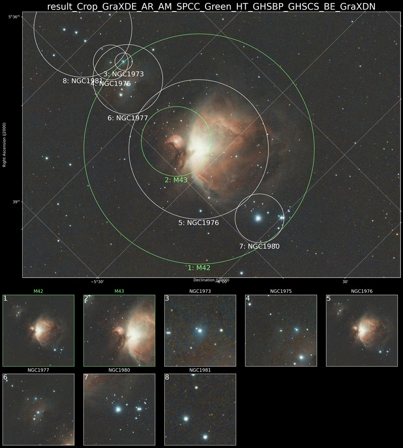
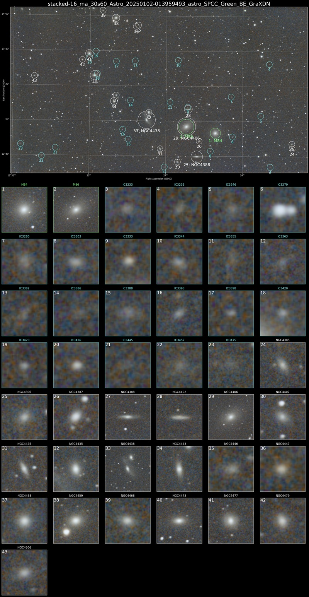

# Siril用 Galaxy Annotationsスクリプト（バージョン 1.0.2-gk.3.1 作成者 gonkane）

このスクリプトは、Siril v1.4.0-beta 用に Steffen Schreiber 氏および Patrick Wagner 氏によって作成された
「Galaxy_Annotations.py」バージョン 1.0.2 をベースに、gonkane が非公式に個人的に改良を加えたものです。

元スクリプトの正式な配布元（GitLab）はこちらです：
<https://gitlab.com/schreiberste/siril-scripts>

元スクリプトは、Simbad 天体データベースから天体情報を取得し、
Siril 上の天体画像にアノテーション（天体名など）を描画するとともに、
認識した天体を個別にピックアップして表形式で表示するとても素晴らしいスクリプトです。
このような有用なスクリプトを開発・公開してくださった Steffen Schreiber 氏および Patrick Wagner 氏に、心より感謝申し上げます。

本スクリプトは、元スクリプトと同様に GNU General Public License v3（GPL v3） に基づいて公開されており、
自由に利用・改変・再配布が可能です。
ただし、再配布の際には同じライセンスを適用する必要があります。
著作権は元作者である Steffen Schreiber 氏および Patrick Wagner 氏に帰属することにご注意ください。
詳しくはリポジトリ内の `LICENSE` ファイルをご参照ください。

---

## 追加機能一覧

- gonkaneのパソコンの環境下では Messier、NGC、IC の一部天体が正しくアノテーションされない問題に対応
- 上記３つのカタログは Siril 内蔵天体データから取得に切り替え
- アノテーションの丸や四角のサイズの計算を改良（RA±、DEC±の 4方向評価による WCS ベースの処理）
- カタログごとにアノテーションの色を自由に設定可能に
- 画像内にある天体一覧を表示し、天体ごとにアノテーションの「表示・非表示」「色」を個別に設定可能に
- 中心座標が同じ天体について、アノテーション（円/枠）が外側にずれるよう改良
- カタログ一覧の表示を縦スクロール対応に変更
- 画像作成後の画像を切り替える C / O / T / N ボタン を追加
　C：アノテーションの画像＋天体サムネイル表　O：アノテーション画像　T：天体サムネイル表　N：元画像
- Siril v1.4.0-beta3 に対応

---

## 対応環境

- Siril v1.4.0-beta2 および v1.4.0-beta3 では動作確認しました
- Siril v1.2.6 以前のバージョンでは動作しません。
- Pythonスクリプトなので、Python本体がインストールされていないと動きません
- Python 3.1.1以上を推奨（間違っていたらすみません）
- Pythonモジュール（Sirilが自動でインストールまたは要求される）：
  - sirilpy（バージョン 0.6.37 以上）
  - numpy, pandas, matplotlib, Pillow
  - astropy, astroquery, scikit-image, ttkthemes

---

## スクリーンショット

### GUI画面

### 出力例 1

### 出力例 2

---

## Siril での使い方

詳しいダウンロード＆インストールの仕方が以下のnote記事を参照してください。
<https://note.com/gonkane_create/n/n158f1d14b81e>

## Siril での使い方（準備から実行まで簡易的なメモ）

### 1. Siril のバージョン確認

このスクリプトは Siril v1.4.0-beta2 , beta3 での動作を確認しています。  
Siril のメニュー「ヘルプ → バージョン情報」で確認してください。

---

### 2. スクリプトを保存する

`Galaxy_Annotations_102gk3_1.py` を、任意の使いやすいフォルダに保存します。  
例： `C:\Users\<あなたの名前>\Documents\SirilScripts\`

---

### 3. Siril にスクリプトの保存先を設定する

1. Siril を起動  
2. メニューから「≡ → 環境 設定」を開く  
3. 「スクリプト」タブを開く  
4. 「スクリプト保存ディレクトリ」の欄に、上で保存したフォルダのパスを入力する  
5. 「適用」を押して環境設定を閉じる  

もしこの設定の仕方がよく分からない場合は、通常であれば  
`C:\Users\（ユーザー名）\AppData\Local\siril-scripts\utility`  
の中に元の `Galaxy_Annotations.py` があるので、そこに `Galaxy_Annotations_102gk3_1.py` を置いておくだけでも問題ありません。

---

### 4. 星の位置情報が付与された画像を開く

このスクリプトは赤経・赤緯（RA/DEC）情報をもとに銀河の位置を特定するため、  
必ずSirilのアストロメトリーなどで星の位置情報が付与された画像を使用してください。

---

### 5. スクリプトを実行する

1. Siril のメニューから「スクリプト → Python Scripts」を選択  
2. `Galaxy_Annotations_102gk2_2.py` を選んで実行  

---

### 6. 設定してアノテーションを生成

設定ウィンドウが表示されます：

- Title：作成画像の表示されるタイトル名
　日本語が入っているとその部分は四角になります。
- Logo：指定したJPEGやPNG画像を天体一覧の右下に追加する
- 表示したいカタログ：チェックを入れて選択、色もカスタマイズ可能

すべて設定したら「Apply」ボタンをクリックしてください。

---

### 7. 出力ファイルについて

画像処理が完了すると、次の3種類の画像が出力されます（元画像と同じフォルダに保存されます）：

| ファイル名例                  | 内容                             |
|------------------------------|----------------------------------|
| `annotated_M101_overlay.png` | 天体アノテーション付きの画像     |
| `annotated_M101_table.png`   | 検出された天体のサムネイル表     |
| `annotated_M101.png`         | 上記2枚を縦に結合した最終画像     |

Siril の画面でどれを読み込むかを選ぶオプションも用意されています。

---

## 注意点

Messier、NGC、IC のデータについては、Siril に内蔵されている以下の `.csv` ファイルを使用します：

C:/Program Files/Siril/share/siril/catalogue

この中に次のファイルが存在する必要があります：

- `messier.csv`
- `ngc.csv`
- `ic.csv`

スクリプト実行時にこれらのファイルが見つからずエラーが発生する場合は、  
お使いのPC内で `messier.csv` を検索し、スクリプト内の該当パス（約154行目）を実際の場所に合わせて修正してください。

---

## バージョン履歴

### 最新バージョン：[Galaxy_Annotations_102gk3_1.py](Galaxy_Annotations_102gk3_1.py)

- 中心座標が同じ天体について、アノテーション（円/枠）が外側にずれるよう改良

### 旧バージョン：[Galaxy_Annotations_102gk3.py](Galaxy_Annotations_102gk3.py)

- 天体ごとに色・表示のオンオフを個別に設定できる新GUIを追加
- Apply / ReApply 実行時に元画像を自動でSirILに再読み込み
- GUIの下部に「C / O / T / N」画像切替ボタンを統合（合成／オーバーレイ／サムネイル表／元画像）
- プレートソルブが未実行の場合、起動直後に警告を表示してスクリプトを終了
  上記はスクリプト実行時に開いている画像を元画像と認識しているために必要になりました

### 旧バージョン：[Galaxy_Annotations_102gk2_2.py](Galaxy_Annotations_102gk2_2.py)
- バージョン: 1.0.2-gk.2.2
- radec2pix() が inf や nan を返す場合に発生していた OverflowError を修正
- ピクセル座標変換時に非有限値（NaN、Inf）を除外するチェックを追加
- 以上の修正で Siril v1.4.0-beta3 に対応

### 旧バージョン：[Galaxy_Annotations_102gk2_1.py](Galaxy_Annotations_102gk2_1.py)
- バージョン: 1.0.2-gk.2.1
- C/O/T/N ボタンによる画像切替機能を GUI に追加

### 旧バージョン：[Galaxy_Annotations_102gk2.py](Galaxy_Annotations_102gk2.py)
- バージョン: 1.0.2-gk.2  
- RA±・DEC± の 4方向評価に基づくアノテーションサイズの計算を改良

### 旧バージョン：[Galaxy_Annotations_102gk1.py](Galaxy_Annotations_102gk1.py)
- 最初に公開したバージョンです

---

## 著作権とライセンス

このスクリプトは、以下のプロジェクトをベースにした改良版です：

- オリジナル作者: Steffen Schreiber 氏、Patrick Wagner 氏  
- 元スクリプト：<https://gitlab.com/schreiberste/siril-scripts>

ライセンスは GNU General Public License v3 またはそれ以降です。  
詳しくはリポジトリ内の `LICENSE` ファイルをご参照ください。
