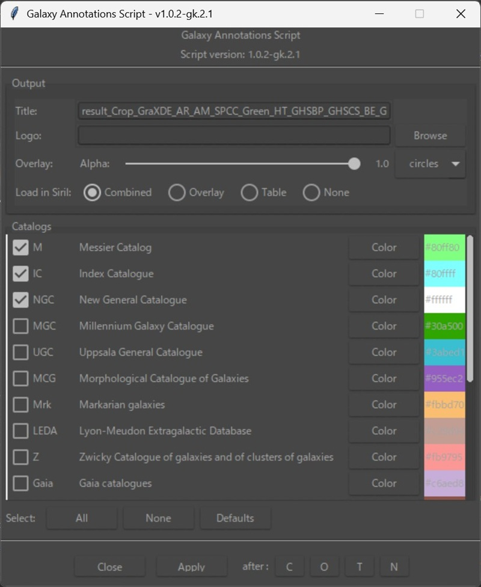
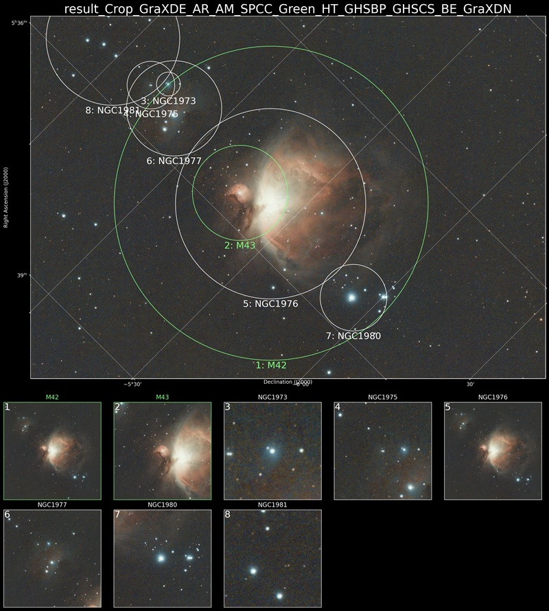
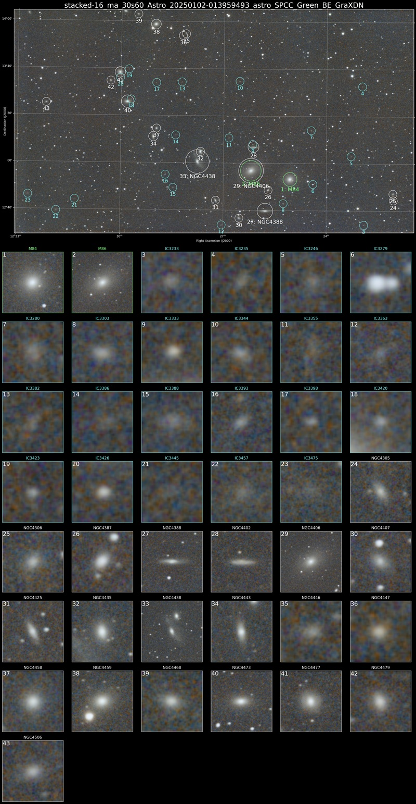

# Siril用 Galaxy Annotationsスクリプト（バージョン 1.0.2-gk.5.2 ）

このスクリプトは、Siril v1.4.0-beta 用に Steffen Schreiber 氏および Patrick Wagner 氏によって作成された
「Galaxy_Annotations.py」バージョン 1.0.2 をベースに、gonkane が非公式に個人的に改良を加えたものです。

元スクリプトの正式な配布元（GitLab）はこちらです：
<https://gitlab.com/schreiberste/siril-scripts>

本スクリプトは、元スクリプトと同様に GNU General Public License v3（GPL v3）に基づいて公開されています。
自由に利用・改変・再配布が可能です。再配布時は同じライセンスを適用してください。
著作権は元作者である Steffen Schreiber 氏および Patrick Wagner 氏に帰属します。
詳しくはリポジトリ内の LICENSE を参照してください。

---

注意:
元のスクリプトは、Simbad の「Galaxy」の銀河のみのアノテーションでしたが
本カスタム版は、Simbad の「Galaxy」の銀河＋Siril内蔵の「Stars、Messier、NGC、IC」のカタログ天体のアノテーションになっています。

## gk.5 の新機能・変更点

- 楕円の長径、短径、回転角も編集可能に。
　円で表示したい場合は長径が円の直径に。
- Objectウィンドウで文字検索フィルターを追加。天体名と表示名から文字を検索・フィルター可能に。
- Export CSV の列名を日本語化。Name と TYPE を含む。表示名の列は末尾へ移動
- Replace CSV は長径、短径、回転角度も含めて内容をそのまま反映（並べ替えなし）

## gk.5.1 の新機能・変更点

- カタログごとにフォントサイズの指定が可能に
- Objectウィンドウでは各天体ごとにフォントサイズの指定が可能に
- Export CSV / Replace CSV でもフォントサイズを保存、読み込み可能に

## gk.5.2 の新機能・変更点

- メインウィンドウでチェックを入れたカタログのフォントサイズをまとめて変更できる機能を追加

参考: 詳細は Galaxy_Annotations_102gk5.py 内の「gk.5 での主な更新」コメントを参照してください。

---

## 対応環境

- Siril v1.4.0-beta2 または v1.4.0-beta3 で動作確認
- Siril v1.2.6 以前は非対応
- Python 3.11 以上を推奨（Siril 同梱 Python で動作）
- 必要モジュール（Siril が自動でインストールや要求を行うものを含む）
  - sirilpy、numpy、pandas、matplotlib、Pillow、astropy、astroquery、scikit-image、ttkthemes

---

## スクリーンショット（当面は gk.3.1 時点の例）

### GUI 画面

### 出力例 1

### 出力例 2

---

## Siril での使い方

1. Siril のバージョン確認。ヘルプ → バージョン情報で v1.4.0-beta2 か v1.4.0-beta3 であることを確認
2. スクリプトを保存。Galaxy_Annotations_102gk5.py を任意のフォルダへ保存
3. Siril でスクリプト保存先を設定。環境設定 → スクリプト → スクリプト保存ディレクトリに 2 のフォルダを指定
4. Plate Solve と画像の準備。RA/DEC 情報付きのプレートソルブ済み画像。ストレッチ後の画像を推奨
5. 実行。スクリプト → Python Scripts から Galaxy_Annotations_102gk5.py を実行
6. 設定と生成。Title、Logo、カタログ選択、Apply、必要に応じて Object ウィンドウで ReApply、標本作成、結合を実行
7. 出力ファイル。処理後、元画像と同じフォルダに以下を保存

| ファイル名例                  | 内容                           |
|------------------------------|--------------------------------|
| annotated_M101_overlay.png   | 天体アノテーション付きの画像   |
| annotated_M101_table.png     | 検出された天体のサムネイル表   |
| annotated_M101.png           | 上記2枚を縦に結合した最終画像  |

Siril の画面から C/O/T/N ボタンで表示を切り替えられます。

---

## 内蔵カタログ（CSV）の場所

スクリプトは Siril のカタログディレクトリを自動検出します。主な場所の例は次のとおりです。

- macOS: /Applications/Siril.app/Contents/Resources/share/siril/catalogue
- macOS（内蔵Python相対）: <Siril>/Resources/share/siril/catalogue
- Linux: /usr/share/siril/catalogue または /usr/local/share/siril/catalogue
- Windows: C:\Program Files\Siril\share\siril\catalogue
- ユーザー設定: <Siril設定ディレクトリ>/catalogue

上記に messier.csv、ngc.csv、ic.csv、stars.csv が存在することを確認してください。
詳細設定から任意の CSV に差し替えることもできます。

## 詳細設定（タブ別の説明）

このダイアログでは、動作や出力を細かく調整できます。以下は主なタブの概要です。

1) カタログ / CSV
- Stars、Messier、IC、NGC の各 CSV の場所を指定します。未指定時は Siril のカタログディレクトリを自動検出します。
- ここで指定した CSV の行順が Objectウィンドウの表示順と No に反映されます。
- Replace CSV は、長径、短径、回転角度を含めて CSV の内容をそのまま反映します（並べ替えは行いません）。
- Export CSV は列名が日本語中心です。Name と TYPE を含み、表示名の列は末尾にあります。

2) サイズ情報無し天体
- 各天体の示し方（円、枠など）を選びます。
- 各天体の画像上の表示名を選びます。初期値は「番号のみ」です。
- ここでの設定は、Stars やサイズ未取得の天体に適用されます。

3) サイズ情報有り天体
- Simbad に長径（円の直径）のデータがある天体の描画方法を指定します。
- 表示名の付け方を選べます（番号、表示名、併記など）。

4) サイズフィルタ
- 直径の下限や上限などを指定します。単位は「分」です。
- 直径100px以上といったピクセル基準を使う場合も、内部で一度だけ角度へ変換してから比較します（計算負荷とメモリの節約）。

5) 天体標本（サムネイル表）
- 1 行に並べる最大天体数、出力レイアウトなどを設定します。
- 上限に満たない行でも、各サムネイルのサイズは揃えます。
- 保存時の dpi は 200 に固定です（Table 画像）。

6) 出力と保存
- タイトル（Title）やロゴ（Logo）の有無、配置を設定します。
- 出力ファイル名や保存先は元画像と同じフォルダに自動で作成されます。

---

## Objectウィンドウの使い方

このウィンドウでは、検出天体の一覧を確認し、表示・ラベル・色・サイズなどを編集できます。

1) 概要
- 先頭行でフィルターやカタログを選ぶと、右側に「選択対象の個数 / 全体」が表示されます。
- その下の行にページング操作があり、Page Size、現在の表示範囲、Page の < > で移動できます。

2) 対象・表示・ラベルの一括操作
- 対象: 「表示天体のみ」または「全ページ天体」を切り替えます。まとめて操作の対象範囲に影響します。
- 表示: All / None / Defaults で表示列を一括変更します。
- ラベル: No+DN / DN / No / Defaults でラベル列を一括変更します。
- どちらのDefaultsも、設定がApplyボタンを押した際の時点に戻ります。

3) 行の編集
- 表の各行をクリックして編集できます。
- 色：ダブルクリックして編集
- 表示：ワンクリックでON/-を切り替え
- No：手動変更はできません。もし変更したい場合はExport CSVでCSVに保存し、上下の順番を入れ替えてください。
　Replace CSVで読み込んだデータは、上から順に番号が振られます。
- ラベル: ワンクリックで No+DN / DN / No を切り替え
- 表示名：ダブルクリックしてダイアログで編集
- 長径、短径（分）、回転角度（度）：ダブルクリックしてダイアログで編集
- 編集結果は ReApply または天体標本作成ボタンで反映され、描画が更新されます。

4) 採番（No）と再採番のタイミング
- 行の表示を ON と − で切り替えても、その場では No は変わりません。
- No は ReApply または 天体標本作成 を実行したタイミングで再び振り直しになります。

5) CSV の入出力
- Export CSV は現状の一覧を日本語列名で書き出します。Name、TYPE、長径（直径）、短径、回転角度、表示名、ラベル、色などを含みます。
- Replace CSV はファイル内容で一覧を置き換えます。長径、短径、回転角度もそのまま反映し、読み込み順が表示順と No に使われます。

6) ページングのコツ
- 大量の天体がある場合は Page Size を小さめにすると操作が軽くなります。
- フィルター入力中の一括操作は、フィルター結果に対して適用されます。

7) 表の列（例）
| 列名 | 説明 |
|-----|-----|
| No | 採番。再採番は ReApply または 天体標本作成で実行 |
| Name | 表示名（任意の別名を設定可能） |
| TYPE | カタログ種別（Stars、M、IC、NGC など） |
| 色 | 注釈の色（16進） |
| 長径 | 分単位の長径。楕円の長径に対応 |
| 短径 | 分単位の短径。楕円の短径に対応 |
| 回転角度 | 度単位の回転角度。楕円の位置角 |
| 表示 | ON または − |
| ラベル | No+DN、DN、No から選択 |

8) 画面切替
- 各画像生成後は O、T、C、N ボタンで
　　O：アノテーションされた画像
　　T：天体標本画像
　　C：結合画像
　　N：元画像
　を切り替えられます。

---

---

## バージョン履歴

最新: Galaxy_Annotations_102gk5_1.py
- カタログごとにフォントサイズの指定が可能に
- Objectウィンドウでは各天体ごとにフォントサイズの指定が可能に
- Export CSV / Replace CSV でもフォントサイズを保存、読み込み可能に

Galaxy_Annotations_102gk5.py
- 楕円の長径、短径、回転角も編集可能に。
　円で表示したい場合は長径が円の直径に。
- Objectウィンドウで文字検索フィルターを追加。天体名と表示名から文字を検索・フィルター可能に。
- Export CSV の列名を日本語化。Name と TYPE を含む。表示名の列は末尾へ移動
- Replace CSV は長径、短径、回転角度も含めて内容をそのまま反映（並べ替えなし）

Galaxy_Annotations_102gk4.py
- Stars カタログ対応、日本語表記、CSV 保存と読込、円半径等の編集 など

Galaxy_Annotations_102gk3_1.py
- 同一中心座標の天体で注釈円や枠が外側へずれるように改良

Galaxy_Annotations_102gk3.py
- 天体ごとの表示と色の個別設定 GUI、Apply/ReApply の元画像再読込、C/O/T/N 切替、未ソルブ時の起動直後警告

Galaxy_Annotations_102gk2_2.py
- radec2pix の非有限値対策、Siril v1.4.0-beta3 対応

Galaxy_Annotations_102gk2_1.py
- C/O/T/N ボタンを GUI に追加

Galaxy_Annotations_102gk2.py
- RA と DEC の評価に基づく注釈サイズの改良

Galaxy_Annotations_102gk1.py
- 最初に公開したバージョン

---

## 著作権とライセンス

オリジナル作者: Steffen Schreiber 氏、Patrick Wagner 氏
元スクリプト: <https://gitlab.com/schreiberste/siril-scripts>
ライセンス: GNU GPL v3 以降（LICENSE 参照）

本スクリプトの拡張と公開にあたり、オリジナル作者の方々に感謝いたします。
